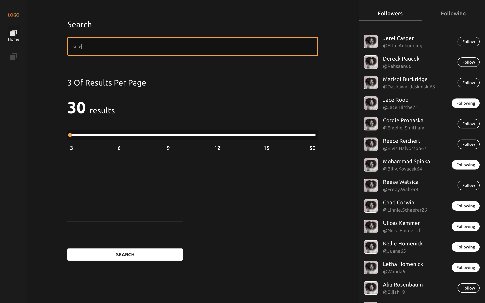
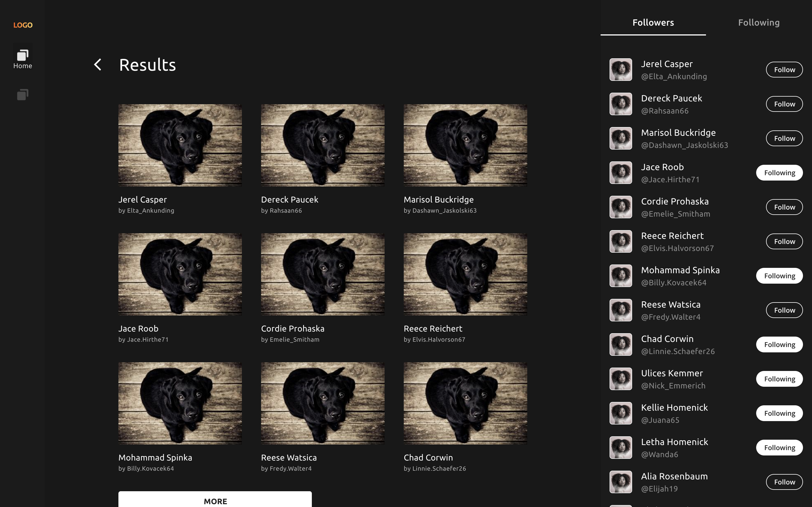
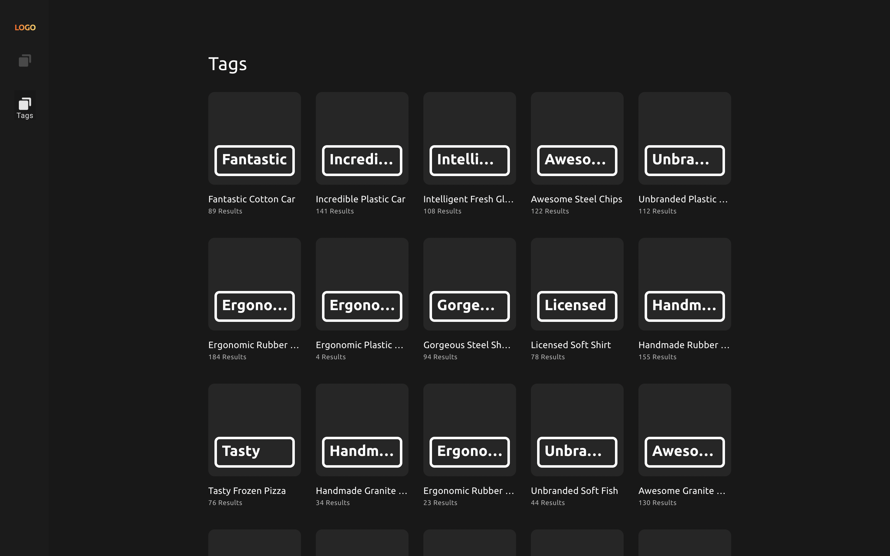
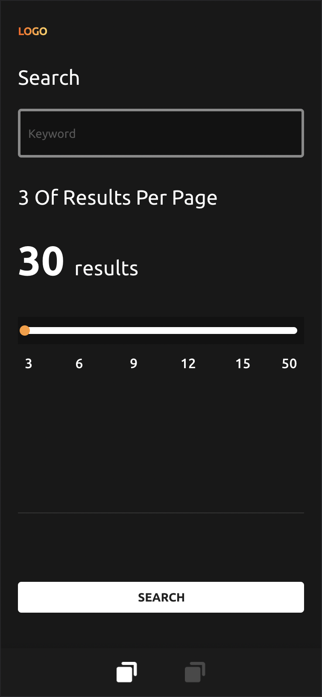
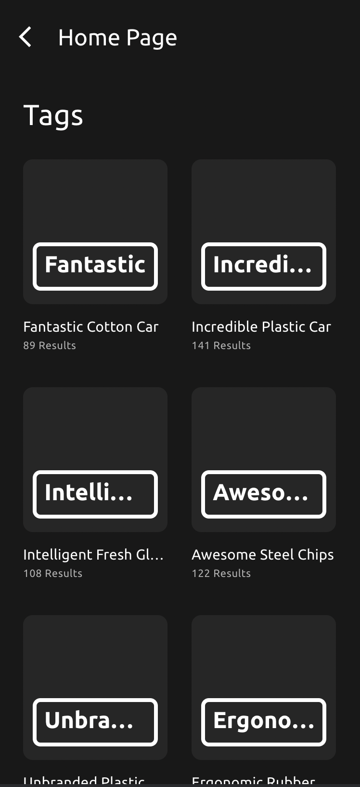

# metax

## Project setup
```
yarn install
```

### Compiles and hot-reloads for development
```
yarn serve
```

### Compiles and minifies for production
```
yarn build
```

### Lints and fixes files
```
yarn lint
```


## Screenshots
<div align="center">
  
  
  
  
  
</div>

## Live Demo 
You can see the Live Demo Web 
Here [https://metax-fe.netlify.app/](https://metax-fe.netlify.app/)

### Customize configuration
See [Configuration Reference](https://cli.vuejs.org/config/).
